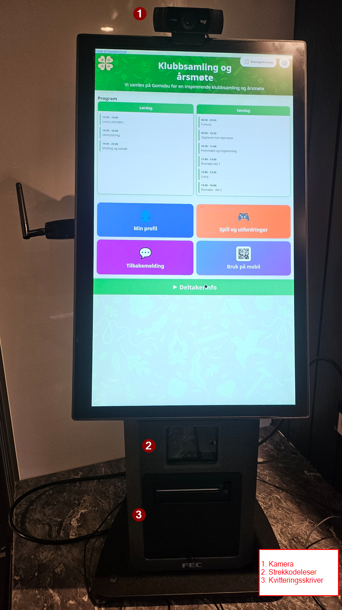
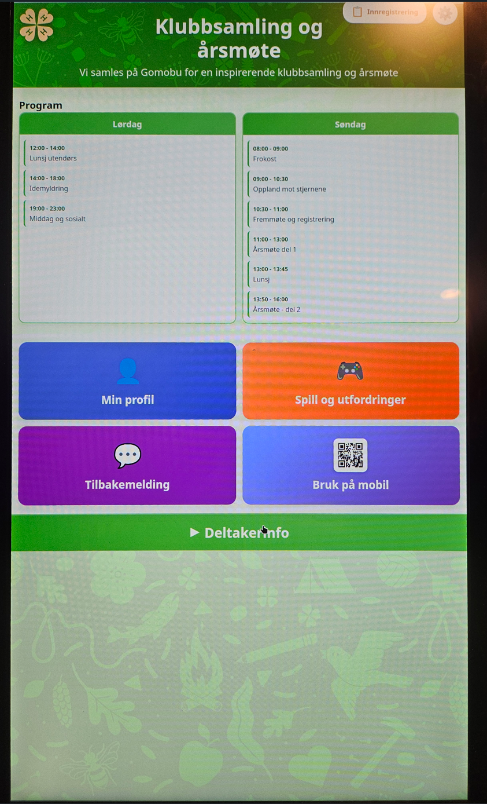
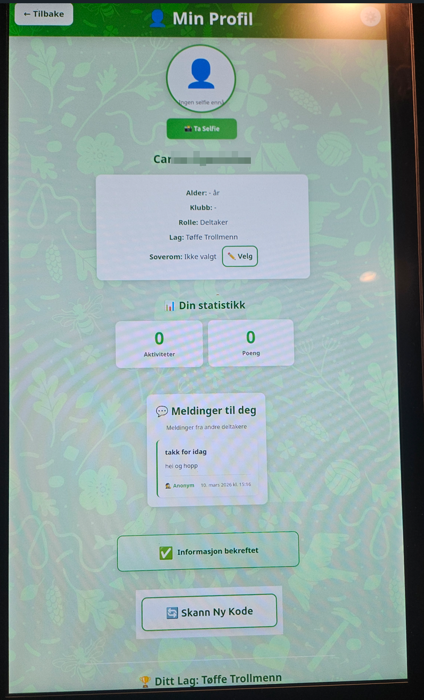
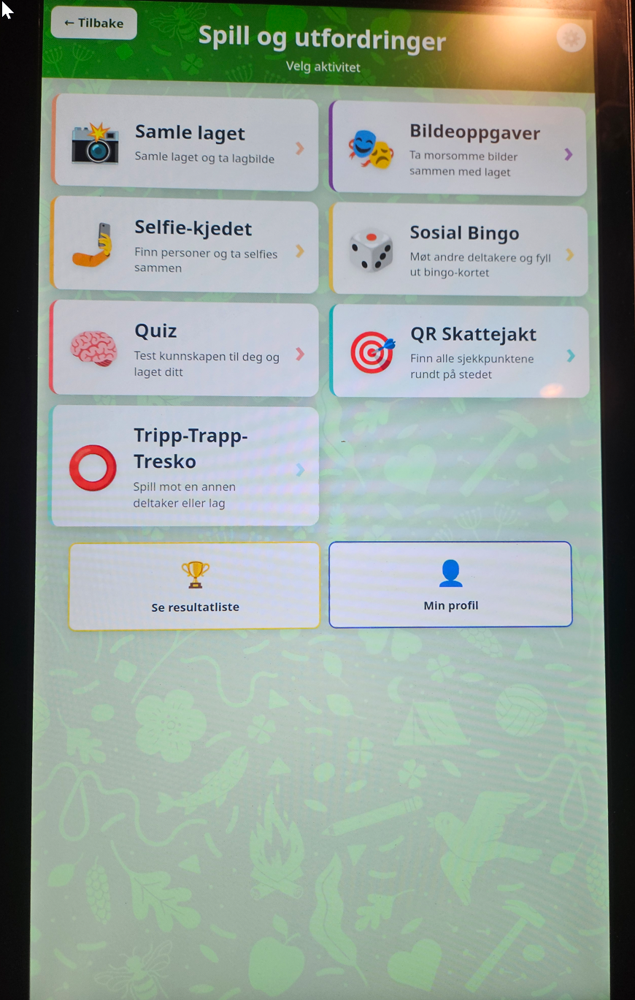
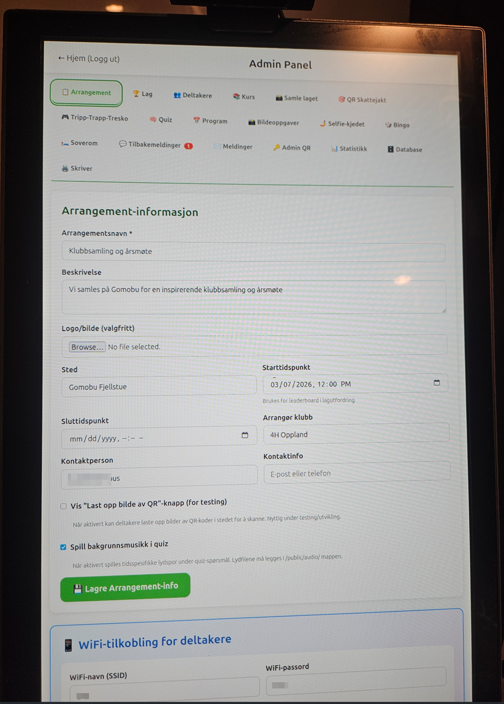
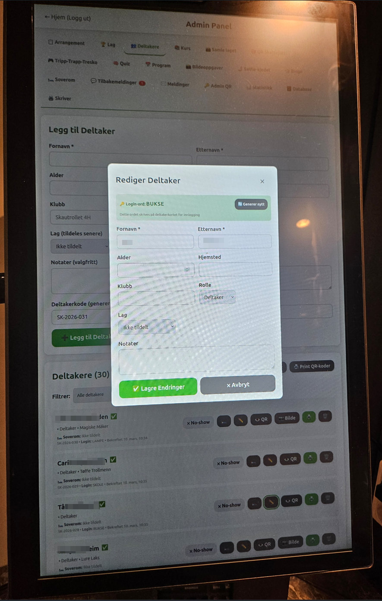
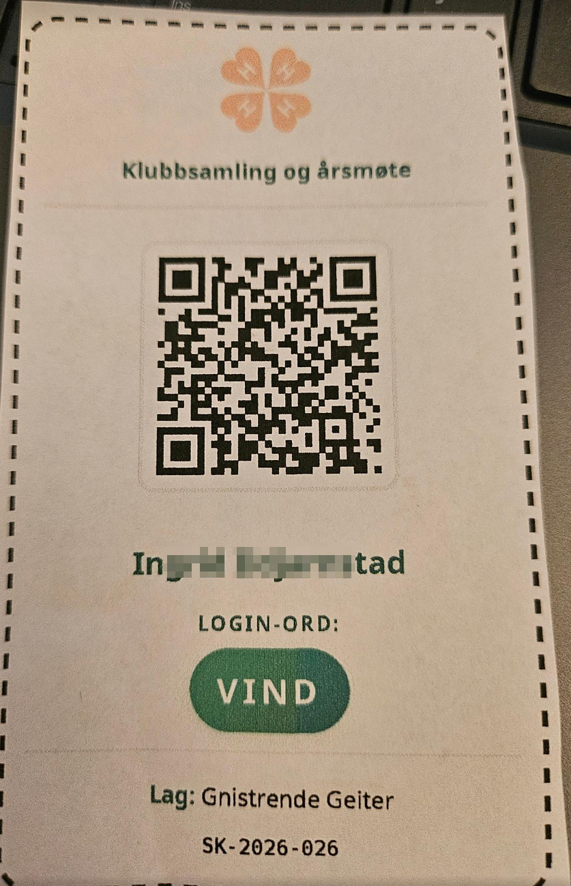
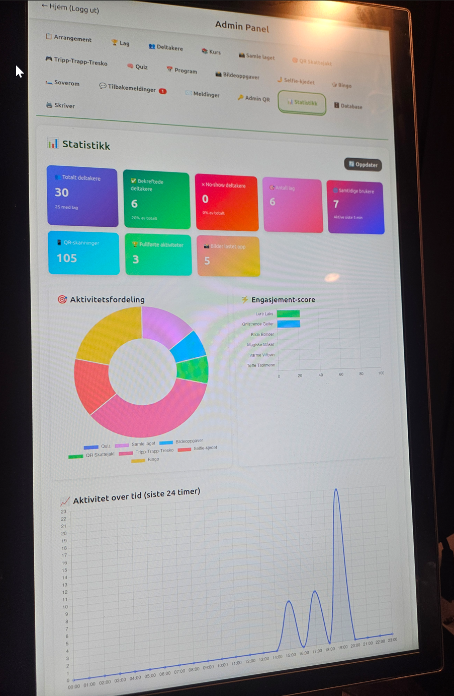

# 4H Arrangement Hjelper - Skautrollet 4H

**En komplett løsning for 4H-arrangement - spar 5-10 timer administrasjon per arrangement!**

En moderne Node.js webapplikasjon som gjør det enkelt å organisere og administrere 4H-leirer og kurs. Laget av en 4H-arrangør med mange års erfaring, basert på reelle utfordringer og testet på faktiske 4H-arrangement.

### 💡 Problemet vi løser

Som 4H-arrangør kjenner du dette:
- "Hvilke kurs går jeg på?" - for hundrede gang
- "Hvor skal jeg sove?" - spør alle deltakere
- "Hva er programmet i morgen?" - hver eneste kveld
- "Stemmer min informasjon?" - må sjekkes manuelt

**Resultat:** 2+ timer daglig brukt på å svare på spørsmål deltakerne kunne funnet svar på selv.

### ✨ Løsningen

Med 4H Event Hub får deltakerne selvbetjening, og arrangørene får tid tilbake til det som betyr noe: **Fellesskapet**.

**Estimert tidsbesparelse: 5-10 timer per arrangement (100 deltakere)**


*Komplett oppsett med PC, strekkodeskanner og kamera - men fungerer like godt uten ekstrautstyr!*

> **🚀 Ny bruker? Start her!** Les [QUICKSTART.md](QUICKSTART.md) for en super-enkel guide (15 minutter fra null til ferdig!)

### 🎯 Hvorfor denne løsningen?

- ✅ **Laget av 4H, for 4H** - Utviklet av klubbrådgiver med arrangørerfaring
- ✅ **Testet i praksis** - Brukt på reelle 4H-leirer og kurs
- ✅ **100% Gratis** - Åpen kildekode, ingen kostnader noensinne
- ✅ **Fungerer uten ekstrautstyr** - Ingen strekkodeskanner? Bruk login-ord!
- ✅ **15 minutter oppsett** - Klar til bruk på rekordtid
- ✅ **Helt nytt i 4H-Norge** - Ingen andre kombinerer administrasjon og sosiale aktiviteter slik

## 📋 Innholdsfortegnelse

- [Funksjoner](#-funksjoner)
- [Teknisk Stack](#-teknisk-stack)
- [Installasjon](#-installasjon)
- [Database Setup](#-database-setup)
- [Kjøre Applikasjonen](#-kjøre-applikasjonen)
- [Admin Panel](#-admin-panel)
- [Bruksanvisning](#-bruksanvisning)
- [Hardware Setup](#-hardware-setup)
- [API Endepunkter](#-api-endepunkter)
- [Feilsøking](#-feilsøking)

## 🎯 Funksjoner

### For Deltakere

#### 🎉 Velkomstside
- **Dedikert velkomstside** for deltakere når de ankommer arrangementet
- Skann QR-kode med strekkodeskanner eller webkamera, eller skriv inn login-ord
- Automatisk redirect til profilside etter scanning
- Vennlig velkommen-melding med deltakers navn
- Enkel og rask onboarding-opplevelse


*Velkomstsiden gjør det enkelt å komme i gang - skann QR-kode eller skriv inn login-ord*

#### 📱 Min Profil
- Skann QR-kode med strekkodeskanner eller webkamera, eller skriv inn login-ord
- Vis deltakerprofil (navn, alder, hjemsted, klubb, rolle, lag)
- **Bekreft informasjon**: Deltakere kan bekrefte at informasjonen stemmer (engangsoperasjon)
- Se bekreftelsesstatus med grønn badge når bekreftet
- Ta selfie med webkamera og lagre på profil
- Se lagkamerater og lagets medlemmer
- Se kurs du er påmeldt


*Deltakerprofil med all informasjon, selfie og mulighet til å bekrefte data*

#### 🏆 Lag & Konkurranser
- **Lagutfordring**: Ta bilder av laget som oppfyller forskjellige oppgaver
- **Bildeoppgaver**: Ta morsomme bilder basert på oppgaver (f.eks. "Alle står på ett ben", "Finn noe grønt")
- **Live Scoreboard**: Se sanntids poengoversikt for alle lag
- **Tic-Tac-Toe**: Spill bondesjakk mot andre lag
- **Quiz**: Svar på quiz-spørsmål som lag og konkurer om beste tid
- **QR Skattejakt**: Skann QR-koder på forskjellige steder og konkurer om best tid


*Mange artige aktiviteter og konkurranser som skaper fellesskap mellom deltakerne*

#### 🤳 Selfie-kjedet
En sosial aktivitet hvor deltakere møter hverandre og tar selfies sammen!

**Slik fungerer det:**
1. Skann din deltaker-QR for å registrere deg
2. Få et oppdrag å finne en bestemt person
3. Finn personen og skann deres QR-kode for å verifisere
4. Ta en morsom selfie sammen
5. Få et nytt oppdrag og fortsett kjeden!

**Poeng:**
- Fullføre selfie: 50 poeng (konfigurerbart)
- Kreativ selfie: opptil 20 bonuspoeng
- Rask (under 5 min): +10 poeng

**Varianter:**

- **🔗 Lineær kjede**: Hver deltaker får en forhåndsdefinert kjede av personer å møte. Alle følger sin egen unike sti gjennom nettverket. Dette gir kontrollert flyt og sikrer at alle deltakere møter et spesifikt antall personer. Perfekt for strukturerte arrangementer hvor du vil sikre at alle får like mange møter.

- **🎲 Tilfeldig**: Hver deltaker får tilfeldig tildelt neste person å møte blant de som ikke er møtt ennå. Dette gir mer variasjon og uforutsigbarhet, men krever at systemet holder oversikt over hvem som har møtt hvem. Godt for å skape spontane møter og unngå forutsigbare mønstre.

- **🕸️ Nettverk**: Alle kan møte alle i valgfri rekkefølge. Deltakere velger selv hvem de vil møte neste, så lenge de ikke har møtt personen før. Dette gir maksimal fleksibilitet og sosial frihet. Ideelt for arrangementer hvor deltakerne kjenner hverandre og kan ta egne valg.

**Funksjoner:**
- QR-verifisering av både deltaker og målperson
- Selfie med webkamera eller opplasting
- "Min kjede" - se alle møtene dine
- Sanntids statistikk (møter, poeng, tid igjen)
- Tidsgrense konfigurerbar i admin

#### 📅 Program
- Se arrangementets program dag for dag
- Oversikt over aktiviteter med klokkeslett og sted

#### 👥 Deltakere
- Se alle deltakere på arrangementet
- Filtrer på lag, klubb og rolle
- Se profilbilder og informasjon

#### 💬 Tilbakemeldinger
- Send anonyme eller identifiserte tilbakemeldinger til arrangørene
- Skann QR-kode for å identifisere deg (valgfritt)
- Skriv tittel og melding med virtuelt tastatur eller fysisk tastatur
- Støtte for både touchskjerm og vanlig tastatur

### For Arrangører (Admin)

#### 🎮 Aktivitets-styring
- **Aktivere/Deaktivere aktiviteter**: Skru enkelt på/av alle aktiviteter under "Spill og utfordringer"
- Uniform checkbox-basert styring for alle aktiviteter
- Deltakere ser kun aktive aktiviteter i aktivitetsoversikten
- Inaktive aktiviteter skjules automatisk fra:
  - Aktivitetslisten på deltakersiden
  - Resultattavle-faner
  - Direkte URL-tilgang (viser "ikke tilgjengelig" melding)
- Konfigurerbar for: Quiz, QR Skattejakt, Tripp-Trapp-Tresko, Samle laget, Bildeoppgaver, Selfie-kjedet, Sosial Bingo

#### 📋 Arrangement
- Opprett og rediger arrangementinformasjon
- Last opp arrangementlogo
- Sett datoer, sted og arrangør
- Statistikk over deltakere per rolle


*Admin-panelet gjør det enkelt å administrere arrangementsinformasjon*

#### 👥 Deltakere
- Legg til nye deltakere med auto-genererte koder
- Importer deltakere fra CSV
- Manuelt opprett og rediger deltakere
- Generer og print QR-koder
- Tildel deltakere til lag (automatisk eller manuelt)
- **Bekreftelsesstatus**: Se ✅ (bekreftet) eller ⏳ (ikke bekreftet) på hver deltaker
- **Filtrer deltakere**: Vis kun bekreftede eller ubekreftede deltakere
- **Bekreft deltaker manuelt**: Klikk ✅-knapp for å bekrefte deltaker
- **Bekreftet tidsstempel**: Se når deltaker ble bekreftet
- **No-show status**: Marker deltaker som ❌ (ikke møtt opp)
- **Fjern no-show**: Klikk "✓ Møtt opp" for å fjerne no-show status
- **Filtrer no-show**: Vis kun deltakere som ikke har møtt opp
- **Live statistikk**: Se antall bekreftede, ubekreftede og no-show i deltakerlisten
- Eksporter deltakerliste


*Komplett oversikt over alle deltakere med bekreftelse- og no-show-status*

#### 🏆 Lag
- Opprett nye lag
- Bulk-opprettelse med auto-genererte norske navn
- Rediger lagstørrelser
- Se lagmedlemmer og statistikk
- Automatisk fordeling av deltakere til lag

#### 🎯 QR Skattejakt
- Opprett sjekkpunkter med navn, hint og QR-kode
- Rediger og slett sjekkpunkter
- Se leaderboard
- Print QR-koder for sjekkpunkter

#### 🎮 Tic-Tac-Toe
- Se pågående og avsluttede spill
- Nullstill spill
- Overvåk spillaktivitet

#### 🧠 Quiz
- Opprett quiz-spørsmål med 4 svaralternativer
- Last opp bilder til spørsmål
- Sett riktig svar og rekkefølge
- Se leaderboard med tid og poeng

#### 📸 Bildeoppgaver
- Opprett bildeoppgaver med tittel, beskrivelse, ikon og poeng
- Se innsendte bilder fra alle lag
- Gi poeng til innsendte bilder (0 til max)
- Godkjenn eller avvis innsendte bilder
- Se leaderboard for bildeoppgaver

#### 🤳 Selfie-kjedet
- Konfigurer aktivitet (aktiv/inaktiv, tidsgrense, poeng per selfie)
- Velg variant:
  - **Lineær kjede**: Forhåndsdefinerte møter for kontrollert flyt
  - **Tilfeldig**: System tildeler tilfeldige møter
  - **Nettverk**: Deltakere velger selv hvem de møter
- Se statistikk (deltakere startet, totalt møter, totalt poeng)
- Se topp 10 deltakere med flest møter
- Se møte-nettverk (hvem har møtt hvem)
- Nullstill aktivitet (slett alle data)

#### 📅 Program
- Opprett programpunkter med tid, tittel, sted og beskrivelse
- Organiser program per dag
- Rediger og slett programpunkter

#### 💬 Tilbakemeldinger
- Motta tilbakemeldinger fra deltakere
- Se hvem som sendte tilbakemelding (eller anonym)
- Filtrer på nye/leste meldinger
- Marker som lest/ulest
- Slett tilbakemeldinger
- Se deltakers navn og klubb på identifiserte meldinger

#### 🗄️ Database Management
- **Last inn testdata**: Genererer 100 deltakere, 5 quiz-spørsmål, 5 skattejakt-poster, lag og arrangement
- **Nullstill database**: Sletter ALL data (deltakere, lag, spill, svar, etc.)
- Sikker nullstilling med dobbel bekreftelse

## 🔧 Teknisk Stack

- **Backend**: Node.js + Express
- **Database**: SQLite (fil-basert, ingen ekstern server nødvendig)
- **Frontend**: Vanilla HTML/CSS/JavaScript
- **QR-generering**: qrcode npm pakke
- **QR-scanning**: html5-qrcode library
- **Bildeprosessering**: Sharp (automatisk komprimering og EXIF-fjerning)
- **Kamera**: Native browser MediaDevices API
- **File Upload**: Multer middleware

**Designet for 4H-klubber:**
- 💰 Ingen eksterne tjenester = 0 kroner i løpende kostnader
- 🔒 All data lokalt = GDPR-vennlig og offline-klar
- 🎯 Ingen teknisk erfaring nødvendig = Alle kan bruke det

## 📦 Installasjon

### Forutsetninger

**Minimum (fungerer for alle):**
- **Node.js** (v14 eller nyere) - [Last ned](https://nodejs.org/)
- **npm** (kommer med Node.js)
- **En PC eller laptop** - Det er alt du trenger!

**Valgfritt ekstrautstyr (forbedrer opplevelsen):**
- **Webkamera** (for selfies og QR-scanning)
- **Strekkodeskanner** (raskere enn å skrive login-ord)
- **Touchskjerm** (for kiosk-modus ved inngang)

> **💡 Tips:** Systemet fungerer perfekt med bare login-ord - ingen ekstrautstyr nødvendig!

### Steg 1: Last ned prosjektet

**Alternativ A: Med Git**
```bash
git clone https://github.com/[din-bruker]/4h-event-hub.git
cd 4h-event-hub
```

**Alternativ B: Last ned ZIP**
1. Klikk "Code" → "Download ZIP" på GitHub
2. Pakk ut ZIP-filen
3. Åpne terminalen i mappen

### Steg 2: Installer avhengigheter

```bash
npm install
```

*Tips: Hvis du får feil, prøv:*
```bash
npm install --registry=https://registry.npmjs.org/
```

### Steg 3: Konfigurer miljøvariabler (valgfritt)

Kopier `.env.example` til `.env` og tilpass innstillingene:

```bash
cp .env.example .env
```

Åpne `.env` og rediger etter behov:
```
# Sett din egen admin PIN-kode (4-6 siffer anbefales)
ADMIN_PIN=1234

# Juster server-port hvis nødvendig
PORT=3000
```

**Viktig**: `.env`-filen blir ikke committet til Git og inneholder konfidensielle innstillinger som admin PIN-koden.

## 🗄️ Database Setup

### Initialiser Database

Første gang du setter opp applikasjonen:

```bash
npm run init-db
```

Dette oppretter SQLite databasen (`database/data.db`) med alle nødvendige tabeller.

### Kjør Database-migrasjoner

Hvis du har lastet ned en nyere versjon av koden, kjør migrasjonene:

```bash
node database/migrate-add-event-info.js
node database/migrate-add-participant-fields.js
node database/migrate-add-teams-table.js
node database/migrate-add-scavenger-hunt.js
node database/migrate-add-tic-tac-toe.js
node database/migrate-add-quiz-base.js
node database/migrate-add-event-start-time.js
node database/migrate-add-program.js
node database/migrate-add-courses.js
node database/migrate-add-photo-challenges.js
node database/migrate-add-feedback.js
node database/migrate-add-participant-confirmed.js
node database/migrate-add-no-show.js
node database/migrate-add-bingo.js
node database/migrate-add-selfie-chain.js
node database/migrate-add-team-challenge.js
node database/migrate-add-login-word.js
node database/migrate-add-wifi.js
node database/migrate-add-sleeping-rooms.js
node database/migrate-add-qr-upload-setting.js
node database/migrate-add-quiz-music-setting.js
node database/migrate-add-quiz-multiple-answers.js
node database/migrate-add-participant-messages.js
node database/migrate-add-activity-configs.js
node database/migrate-fix-quiz-constraint.js
node database/migrate-fix-quiz-answers-constraint.js
node database/migrate-update-team-challenge-points.js
```

*Tips: Du kan kjøre alle migrasjonene på en gang uten feil - skript som allerede er kjørt vil bli hoppet over.*

**Eller kjør alle på en gang:**
```bash
node database/migrate.js
```

### Last inn Testdata (Valgfritt)

For å teste applikasjonen med dummy-data:

1. Start serveren (se nedenfor)
2. Åpne Admin Panel: http://localhost:3000/admin.html
3. Gå til **Database** fanen
4. Klikk **"Last inn testdata"**

Dette oppretter:
- 1 arrangement (Sommerleir 2026)
- 100 testdeltakere
- 20 klubber
- 15 lag
- 6 kurs (Melkeforedling, Styrketrening, Volleyball, Matlaging, Håndarbeid, Foto og film)
- Deltakere påmeldes automatisk til 1-2 kurs hver
- 5 quiz-spørsmål
- 5 skattejakt-sjekkpunkter
- 6 bildeoppgaver (Blid 4H-leder, Alle på ett ben, Menneskepyramide, osv.)

### Nullstill Database

For å slette ALL data og starte på nytt:

1. Åpne Admin Panel: http://localhost:3000/admin.html
2. Gå til **Database** fanen
3. Klikk **"Nullstill Database"**
4. Bekreft THREE ganger (det er meningen!)
5. Skriv "SLETT ALT" for å bekrefte

**Advarsel**: Dette sletter PERMANENT:
- Alle deltakere og profilbilder
- Alle lag
- Alle kurs og kurspåmeldinger
- Alle quiz-svar og økter
- Alle skattejakt-økter
- Alle spill (tic-tac-toe)
- Alle lagutfordring-svar
- Alle tilbakemeldinger
- Arrangement-informasjon
- Alle program-poster

## 🚀 Kjøre Applikasjonen

### Start Server

```bash
npm start
```

Serveren starter på: **http://localhost:3000**

Du vil se:
```
Server running on port 3000
✅ Database connected
```

### Åpne Applikasjonen

- **Hovedside**: http://localhost:3000
- **Velkomstside**: http://localhost:3000/welcome.html *(ny deltaker-onboarding)*
- **Min Profil**: http://localhost:3000/profile.html
- **Admin Panel**: http://localhost:3000/admin.html
- **Quiz**: http://localhost:3000/quiz.html
- **Program**: http://localhost:3000/program.html
- **Tilbakemeldinger**: http://localhost:3000/feedback.html

## 👨‍💼 Admin Panel

### Tilgang

Åpne: http://localhost:3000/admin.html

*NB: Det er ingen passord-beskyttelse. For produksjon, legg til autentisering.*

### Admin-faner

1. **📋 Arrangement** - Rediger arrangementinfo, last opp logo
2. **🏆 Lag** - Administrer lag, bulk-opprett, se medlemmer
3. **👥 Deltakere** - Legg til, rediger, slett deltakere, tildel lag
4. **📸 Samle laget** - Aktiver/deaktiver aktivitet, se leaderboard og lagbilder
5. **🎭 Bildeoppgaver** - Opprett oppgaver, godkjenn/avvis innsendte bilder, gi poeng
6. **🤳 Selfie-kjedet** - Konfigurer varianter, se statistikk og nettverk, aktiver/deaktiver
7. **🎲 Sosial Bingo** - Opprett bingo-oppgaver, konfigurer poeng, aktiver/deaktiver
8. **🎯 QR Skattejakt** - Opprett sjekkpunkter, se leaderboard, aktiver/deaktiver
9. **🎮 Tripp-Trapp-Tresko** - Se spill, nullstill, aktiver/deaktiver
10. **🧠 Quiz** - Administrer spørsmål, se leaderboard, aktiver/deaktiver
11. **📅 Program** - Opprett program for arrangementet
12. **💬 Tilbakemeldinger** - Se og administrer tilbakemeldinger fra deltakere
13. **📊 Statistikk** - Oversikt, analyse og bekreftelsestatistikk (KPI-kort med bekreftede/ubekreftede deltakere)
14. **🗄️ Database** - Last testdata, nullstill database

**Aktivitets-styring i hver aktivitet-tab:**
- Hver aktivitet (Quiz, Skattejakt, osv.) har nå en "Konfigurasjon"-seksjon
- Enkel checkbox for å aktivere/deaktivere aktiviteten
- Inaktive aktiviteter vises ikke for deltakere
- Endringer trer i kraft øyeblikkelig

## 📖 Bruksanvisning

### For Deltakere

#### Velkommen til arrangementet (Første gang)

**Anbefalt for nye deltakere:**
1. Åpne Velkomstsiden: http://localhost:3000/welcome.html
2. Skann din QR-kode med strekkodeskanner eller webkamera
3. Du blir ønsket velkommen med navn! 🎉
4. Automatisk videreført til profilsiden

**Fordeler med velkomstsiden:**
- Enkel og vennlig førstegangsopplevelse
- Tydelig instruksjon for scanning
- Automatisk flyt til profilside

#### Skanne QR-kode (Vanlig vei)

**Metode 1: Strekkodeskanner (Anbefalt for arrangementer)**
1. Åpne Min Profil: http://localhost:3000/profile.html
2. Skjermen viser "Strekkodeskanner klar"
3. Hold QR-koden foran strekkodeskanneren
4. Profilen vises automatisk

**Metode 2: Webkamera**
1. Åpne Min Profil
2. Klikk **"Start Kamera-Skanning"**
3. Gi kamera-tillatelse
4. Hold QR-koden foran kameraet
5. Profilen vises automatisk

#### Bekrefte informasjon

**Første gang du ser profilen din:**
1. Les gjennom informasjonen (navn, alder, klubb, rolle, lag)
2. Sjekk at alt stemmer
3. Klikk **"✅ Bekreft informasjon"** hvis alt er riktig
4. Du får en grønn badge: "✅ Informasjon bekreftet"

**Viktig:**
- Dette er en engangsoperasjon - du kan bare bekrefte én gang
- Hvis noe er feil, kontakt arrangør før du bekrefter
- Arrangører kan se i admin hvem som har bekreftet

#### Ta Selfie

1. Når profilen er åpen, klikk **"Ta Selfie"**
2. Gi kamera-tillatelse hvis nødvendig
3. Poser for kameraet
4. Klikk **"Ta Bilde"**
5. Fornøyd? Klikk **"Lagre Selfie"**
6. Vil du ta på nytt? Klikk **"Ta På Nytt"**

#### Spill Quiz

1. Åpne Quiz: http://localhost:3000/quiz.html
2. Skann deltaker-QR for å starte
3. Velg lag hvis du er på flere lag
4. Svar på spørsmålene så raskt som mulig
5. Se resultat og poeng når du er ferdig

#### Delta i QR Skattejakt

1. Åpne QR Skattejakt: http://localhost:3000/scavenger-hunt.html
2. Skann deltaker-QR
3. Velg lag
4. Les hintet
5. Finn stedet og skann QR-koden
6. Fortsett til alle sjekkpunkter er funnet
7. Se tid og plassering

#### Send Tilbakemelding

1. Åpne Tilbakemeldinger: http://localhost:3000/feedback.html
2. Velg **Anonym** eller **Med navn**
   - **Anonym**: Send tilbakemelding uten å identifisere deg
   - **Med navn**: Skann din deltaker-QR for å identifisere deg
3. Hvis du valgte **Med navn**:
   - Skann QR-koden med strekkodeskanner eller
   - Klikk **"Start Kamera-Skanning"** for å bruke webkamera
4. Skriv tilbakemelding:
   - Tittel (valgfritt)
   - Melding (påkrevd)
   - Bruk virtuelt tastatur eller fysisk tastatur
5. Klikk **"Send inn"**
6. Du får bekreftelse når tilbakemeldingen er sendt

### For Arrangører

#### Opprette Arrangement

1. Åpne Admin Panel → **Arrangement**
2. Fyll inn:
   - Arrangementsnavn
   - Beskrivelse
   - Sted
   - Startdato og sluttdato
   - Starttidspunkt
   - Arrangørnavn og kontaktinfo
3. Last opp logo (valgfritt)
4. Klikk **"Lagre Arrangement-info"**

#### Legge til Deltakere

**Manuelt (enkeltvis):**
1. Gå til **Deltakere** fanen
2. Klikk **"Legg til Deltaker"**
3. Fyll inn informasjon
4. Klikk **"Legg til Deltaker"**
5. QR-kode genereres automatisk

**Import fra CSV:**
1. Klikk **"Importer CSV"**
2. Velg CSV-fil med kolonnene: `first_name,last_name,age,home_location,club,role,team`
3. Deltakere legges til automatisk

#### Opprette Lag

**Enkeltvis:**
1. Gå til **Lag** fanen
2. Klikk **"Nytt Lag"**
3. Skriv inn lagnavn og max medlemmer
4. Klikk **"Lagre"**

**Bulk (flere lag samtidig):**
1. Klikk **"Opprett Flere Lag"**
2. Skriv inn antall lag (1-50)
3. Lagnavnene genereres automatisk med mønster:
   - Adjektiv + Substantiv på samme bokstav
   - Eksempel: "Glade Geiter", "Raske Rever"

#### Tildele Deltakere til Lag

**Automatisk:**
1. Gå til **Lag** fanen
2. Klikk **"Tildel lag automatisk"**
3. Bekreft antall lag
4. Systemet fordeler deltakere jevnt

**Manuelt:**
1. Gå til **Deltakere** fanen
2. Klikk **"Rediger"** på en deltaker
3. Velg lag fra dropdown
4. Klikk **"Oppdater Deltaker"**

#### Administrere Deltaker-bekreftelser

**Se bekreftelsesstatus:**
1. Gå til **Deltakere** fanen i admin
2. Hver deltaker viser status:
   - ✅ = Bekreftet (grønn badge)
   - ⏳ = Ikke bekreftet (grå badge)
3. Tidsstempel vises for når deltaker bekreftet (hvis bekreftet)

**Filtrere deltakere:**
1. Bruk dropdown-filteret over deltakerlisten
2. Velg:
   - **Alle deltakere** - Vis alle
   - **✅ Kun bekreftede** - Vis bare de som har bekreftet
   - **⏳ Kun ubekreftede** - Vis bare de som ikke har bekreftet
3. Se live statistikk: "(X bekreftet, Y ubekreftet)"

**Manuelt bekrefte deltaker:**
1. Finn deltaker som ikke er bekreftet (⏳)
2. Klikk på ✅-knappen til høyre for deltakeren
3. Bekreft i dialog-boksen
4. Deltakeren markeres som bekreftet med tidsstempel

**Bruksscenarier:**
- Hjelpe deltakere som har tekniske problemer
- Bekrefte deltakere som ikke har tilgang til QR/telefon
- Kvalitetssikre før arrangement starter
- Rask oversikt over hvem som har sjekket inn

#### Administrere No-Show

**Markere deltaker som no-show:**
1. Gå til **Deltakere** fanen i admin
2. Finn deltaker som ikke har møtt opp
3. Klikk på ❌-knappen til høyre for deltakeren
4. Bekreft i dialog-boksen
5. Deltakeren markeres med rød ❌ badge og tidsstempel

**Fjerne no-show status:**
1. Finn deltaker som er markert som no-show (❌)
2. Klikk på **"✓ Møtt opp"** knappen
3. Bekreft i dialog-boksen
4. No-show status fjernes og deltaker vises normalt

**Filtrere no-show:**
1. Bruk dropdown-filteret over deltakerlisten
2. Velg **❌ Kun no-show** for å se bare deltakere som ikke har møtt opp
3. Live statistikk viser: "(X bekreftet, Y ubekreftet, Z no-show)"

**Visning:**
- No-show deltakere har rød bakgrunn i listen
- ❌ badge vises på deltaker som ikke har møtt opp
- Tidsstempel vises for når deltaker ble markert som no-show
- No-show statistikk vises på statistikk-siden

**Bruksscenarier:**
- Holde oversikt over deltakere som ikke har møtt opp
- Frigjøre ledig plass til andre deltakere
- Rapportering og oppfølging etter arrangement
- Statistikk over fremmøte

#### Print QR-koder

**For Deltakere:**
1. Gå til **Deltakere** fanen
2. Klikk **"Print QR-koder"**
3. Velg print i nettleseren
4. Skriv ut på klistremerker eller kartong


*Eksempel på deltakerkort med QR-kode og login-ord - kan skannes eller skrives inn manuelt*

**For Skattejakt:**
1. Gå til **QR Skattejakt** fanen
2. Klikk **"Print QR"** på hvert sjekkpunkt
3. Skriv ut og plasser på steder

#### Opprette Program

1. Gå til **Program** fanen
2. Klikk **"Nytt Programpunkt"**
3. Fyll inn:
   - Tittel
   - Beskrivelse (valgfritt)
   - Starttid og sluttid
   - Sted (valgfritt)
   - Dag-nummer
4. Klikk **"Lagre"**

#### Se og bekrefte deltakere

1. Gå til **Deltakere** i hovedmenyen (ikke admin)
2. Søk etter deltaker ved å skrive navn
3. Klikk på deltaker for å se detaljer i modal:
   - Profilbilde
   - Navn, alder, klubb, rolle, lag
   - **Bekreftelsesstatus**:
     - ✅ Bekreftet (grønn badge)
     - ⏳ Ikke bekreftet (grå tekst)
4. **Manuelt bekrefte deltaker** (hvis ikke bekreftet):
   - Klikk **"✅ Marker som bekreftet"**
   - Deltakeren er nå bekreftet som om de selv gjorde det

**Bruk dette for:**
- Hjelpe deltakere som ikke finner bekreft-knappen
- Bekrefte deltakere som ikke har smarttelefon/QR-tilgang
- Kvalitetssikre at alle har bekreftet før arrangement starter

#### Administrere Tilbakemeldinger

1. Gå til **Tilbakemeldinger** fanen
2. Se oversikt over alle tilbakemeldinger:
   - **✨ NY** - Uleste tilbakemeldinger (grønn markering)
   - **✓ LEST** - Leste tilbakemeldinger
3. Filtrer tilbakemeldinger:
   - Alle / Nye / Leste
4. Se hvem som sendte:
   - **🕵️ ANONYM** - Anonym tilbakemelding
   - **👤 Navn (Klubb)** - Identifisert deltaker med klubb
5. Klikk på tilbakemelding for å se detaljer:
   - Tittel og fullstendig melding
   - Avsender (navn og klubb eller anonym)
   - Sendt inn dato/tid
   - Lest dato/tid (hvis lest)
6. Handlinger:
   - **Merk som lest/ulest** - Endre status
   - **Slett** - Fjern tilbakemelding (permanent)

#### Se bekreftelsestatistikk

1. Gå til **Statistikk** fanen i admin
2. Se KPI-kort med bekreftelsesinformasjon:
   - **👥 Totalt deltakere** - Totalt antall påmeldte
   - **✅ Bekreftede deltakere** - Antall og prosent som har bekreftet
   - **❌ No-show deltakere** - Antall og prosent som ikke har møtt opp
   - **⏳ Ubekreftede deltakere** - Antall og prosent som ikke har bekreftet (vises implisitt)
3. KPI-kortene har fargekodede gradienter for enkel avlesning
4. Statistikken oppdateres i sanntid når du klikker "🔄 Oppdater"


*Live statistikk med KPI-kort for bekreftelsesstatus og no-show oversikt*

**Eksempel på KPI-visning:**
- **Bekreftede**: "47 deltakere (75% av totalt)" - grønn gradient
- **No-show**: "3 deltakere (5% av totalt)" - rød gradient
- **Ubekreftede**: "16 deltakere (25% av totalt)" - rosa gradient

**Bruk dette for:**
- Overvåke hvor mange som har sjekket inn
- Holde oversikt over deltakere som ikke har møtt opp
- Planlegge når arrangement kan starte
- Identifisere deltakere som trenger hjelp
- Få raskt overblikk over oppmøte-status

## 💻 Hardware Setup

### Webkamera

**Innebygget Kamera:**
- De fleste laptops fungerer direkte
- Nettleseren ber om tillatelse første gang

**Eksternt USB-kamera:**
1. Koble til USB
2. Vent til det installeres (Windows)
3. Test i kamera-appen først
4. Åpne applikasjonen og gi tillatelse

### Strekkodeskanner

**Anbefalt type:**
- USB eller trådløs 2D-skanner
- Må kunne lese QR-koder
- Keyboard-emulation modus

**Setup:**
1. Koble til USB (eller par trådløst)
2. Test i et tekstfelt (Notepad/TextEdit)
3. Skann en QR-kode
4. Sjekk at den skriver koden + Enter
5. Klar til bruk!

**Konfigurere skanner:**
- Sjekk manualen for "Keyboard mode"
- Aktiver "Send Enter" etter scan
- Deaktiver prefiks/suffiks hvis mulig

### Touchskjerm (Valgfritt)

For kiosk-modus på arrangementer:
1. Koble til USB touchskjerm
2. Kalibrer touchskjermen i OS-innstillinger
3. Åpne nettleser i fullscreen (F11)
4. Deltakere kan bruke touch i stedet for mus

### Printer

For utskrift av QR-koder:
- Vanlig skriver fungerer
- Klebemerke-printer anbefales
- Print på A4 og klipp ut, eller
- Print direkte på klistremerker

## 🔌 API Endepunkter

### Deltakere
- `GET /api/participants` - Hent alle deltakere
- `GET /api/participants/:code` - Hent spesifikk deltaker
- `POST /api/participants` - Opprett ny deltaker
- `PUT /api/participants/:code` - Oppdater deltaker
- `DELETE /api/participants/:code` - Slett deltaker
- `POST /api/participants/:code/photo` - Last opp selfie
- `POST /api/participants/:code/confirm` - Bekreft deltaker (engangsoperasjon)
- `POST /api/participants/:code/no-show` - Marker deltaker som no-show (admin)
- `DELETE /api/participants/:code/no-show` - Fjern no-show status (admin)

### Lag (Teams)
- `GET /api/teams` - Hent alle lag
- `GET /api/teams/:id` - Hent spesifikt lag
- `POST /api/teams` - Opprett nytt lag
- `PUT /api/teams/:id` - Oppdater lag
- `DELETE /api/teams/:id` - Slett lag

### QR-koder
- `GET /api/qr/:code` - Hent/generer QR-kode
- `POST /api/qr/generate-batch` - Generer QR for alle deltakere

### Kurs
- `GET /api/courses` - Hent alle kurs
- `GET /api/courses/:id` - Hent spesifikt kurs
- `POST /api/courses` - Opprett nytt kurs
- `PUT /api/courses/:id` - Oppdater kurs
- `DELETE /api/courses/:id` - Slett kurs
- `GET /api/courses/:id/participants` - Hent deltakere i et kurs
- `GET /api/courses/participant/:participantCode` - Hent kurs for en deltaker
- `POST /api/courses/enroll` - Meld deltaker på kurs
- `DELETE /api/courses/unenroll` - Meld deltaker av kurs

### Aktiviteter (Felles)
- `GET /api/activities/status` - Hent status (aktiv/inaktiv) for alle aktiviteter

### Quiz
- `GET /api/quiz/questions` - Hent alle quiz-spørsmål
- `POST /api/quiz/questions` - Opprett spørsmål
- `PUT /api/quiz/questions/:id` - Oppdater spørsmål
- `DELETE /api/quiz/questions/:id` - Slett spørsmål
- `POST /api/quiz/start` - Start quiz-økt
- `POST /api/quiz/answer` - Send inn svar
- `GET /api/quiz/leaderboard` - Hent leaderboard
- `GET /api/quiz/admin/config` - Hent quiz-konfigurasjon (aktiv/inaktiv)
- `POST /api/quiz/admin/config` - Oppdater quiz-konfigurasjon

### QR Skattejakt
- `GET /api/scavenger/checkpoints` - Hent alle sjekkpunkter
- `POST /api/scavenger/checkpoints` - Opprett sjekkpunkt
- `POST /api/scavenger/start` - Start skattejakt-økt
- `POST /api/scavenger/scan` - Registrer scan
- `GET /api/scavenger/leaderboard` - Hent leaderboard
- `GET /api/scavenger/admin/config` - Hent skattejakt-konfigurasjon
- `POST /api/scavenger/admin/config` - Oppdater skattejakt-konfigurasjon

### Tripp-Trapp-Tresko
- `GET /api/tic-tac-toe/admin/config` - Hent konfigurasjon
- `POST /api/tic-tac-toe/admin/config` - Oppdater konfigurasjon

### Samle laget
- `GET /api/team-challenge/admin/config` - Hent konfigurasjon
- `POST /api/team-challenge/admin/config` - Oppdater konfigurasjon

### Bildeoppgaver
- `GET /api/photo-challenges/admin/config` - Hent konfigurasjon
- `POST /api/photo-challenges/admin/config` - Oppdater konfigurasjon

### Selfie-kjedet
- `GET /api/selfie-chain/admin/config` - Hent konfigurasjon
- `POST /api/selfie-chain/admin/config` - Oppdater konfigurasjon

### Sosial Bingo
- `GET /api/bingo/admin/config` - Hent konfigurasjon
- `POST /api/bingo/admin/config` - Oppdater konfigurasjon

### Program
- `GET /api/program` - Hent alle programpunkter
- `POST /api/program` - Opprett programpunkt
- `PUT /api/program/:id` - Oppdater programpunkt
- `DELETE /api/program/:id` - Slett programpunkt

### Tilbakemeldinger
- `GET /api/feedback` - Hent alle tilbakemeldinger
- `GET /api/feedback/count/new` - Hent antall nye/uleste meldinger
- `POST /api/feedback` - Send inn tilbakemelding
- `PUT /api/feedback/:id/read` - Marker som lest
- `PUT /api/feedback/:id/unread` - Marker som ulest
- `DELETE /api/feedback/:id` - Slett tilbakemelding (soft delete)

### Arrangement
- `GET /api/event` - Hent arrangementinfo
- `PUT /api/event` - Oppdater arrangementinfo
- `POST /api/event/logo` - Last opp logo

### Admin
- `POST /api/admin/reset` - Nullstill database
- `POST /api/admin/load-dummy-data` - Last inn testdata
- `POST /api/admin/bulk-create-teams` - Bulk-opprett lag

## 🐛 Feilsøking

### Serveren starter ikke

**Problem**: `Error: Cannot find module...`
- **Løsning**: Kjør `npm install` på nytt

**Problem**: `Port 3000 is already in use`
- **Løsning**:
  - Stopp eksisterende server (Ctrl+C)
  - Eller endre port i `server.js` (linje 6)

### Database-feil

**Problem**: `SQLITE_ERROR: no such table`
- **Løsning**: Kjør database-migrasjonene på nytt

**Problem**: `Database is locked`
- **Løsning**:
  - Stopp serveren
  - Slett `database/data.db`
  - Kjør `npm run init-db`

### Kamera fungerer ikke

**Problem**: Får ikke tilgang til kamera
- **Løsning**:
  1. Sjekk nettleser-innstillinger for kamera-tillatelse
  2. Bruk Chrome eller Edge (best støtte)
  3. På Mac: Sjekk System Preferences → Security & Privacy → Camera
  4. På Windows: Sjekk Settings → Privacy → Camera

**Problem**: Kameraet er svart/tomt
- **Løsning**:
  - Lukk andre programmer som bruker kameraet (Zoom, Teams, etc.)
  - Koble USB-kameraet ut og inn igjen
  - Restart nettleseren

### Strekkodeskanner fungerer ikke

**Problem**: Skanneren leser ikke QR-koder
- **Løsning**:
  1. Test i et tekstfelt først (Notepad)
  2. Sjekk at den er i "keyboard mode"
  3. Sjekk at den sender Enter etter scanning
  4. Sjekk at QR-koden er trykt i god kvalitet

**Problem**: Skanneren skriver feil tegn
- **Løsning**:
  - Konfigurer keyboard layout i skanner-innstillinger
  - Scan konfigurasjonskoden i manualen for Norwegian keyboard

### QR-koder scannes ikke med kamera

**Problem**: Kameraet ser QR-koden men registrerer ikke
- **Løsning**:
  1. Sørg for god belysning
  2. Hold QR-koden stille og i fokus
  3. Ikke hold for nært eller for langt unna
  4. Sjekk at QR-koden er trykt skarpt (ikke uskarpt)
  5. Prøv å øke størrelsen på QR-koden ved printing

### Bilder lastes ikke opp

**Problem**: Selfies lagres ikke
- **Løsning**:
  1. Sjekk at `uploads/profile-photos/` mappen eksisterer
  2. Sjekk skrivetillatelser på mappen
  3. Sjekk nettverks-fanen i browser DevTools for feil

## 📁 Prosjektstruktur

```
4h-event-hub/
├── package.json              # npm konfigurasjon og scripts
├── server.js                 # Express server hovedfil
├── database/
│   ├── init.js              # Database initialisering
│   ├── schema.sql           # Database schema
│   ├── data.db              # SQLite database (genereres automatisk)
│   └── migrate-*.js         # Database migrasjoner
├── routes/
│   ├── participants.js      # Deltaker API
│   ├── qr.js                # QR-kode API
│   ├── event.js             # Arrangement API
│   ├── teams.js             # Lag API
│   ├── courses.js           # Kurs API
│   ├── quiz.js              # Quiz API
│   ├── scavenger-hunt.js    # Skattejakt API
│   ├── tic-tac-toe.js       # Tic-Tac-Toe API
│   ├── team-challenge.js    # Lagutfordring API
│   ├── program.js           # Program API
│   ├── feedback.js          # Tilbakemeldinger API
│   └── admin.js             # Admin API
├── public/
│   ├── index.html           # Hovedside med navigasjon
│   ├── welcome.html         # Velkomstside for nye deltakere
│   ├── profile.html         # Profilside (QR-scan + selfie + bekreft)
│   ├── admin.html           # Admin panel
│   ├── quiz.html            # Quiz
│   ├── scavenger-hunt.html  # QR Skattejakt
│   ├── tic-tac-toe.html     # Tripp-Trapp-Tresko
│   ├── team-challenge.html  # Lagutfordring
│   ├── program.html         # Program oversikt
│   ├── participant-info.html # Deltakeroversikt
│   ├── live-scoreboard.html # Live scoreboard
│   ├── feedback.html        # Tilbakemeldinger
│   ├── css/                 # Stylesheets
│   └── js/                  # Client-side JavaScript
├── uploads/
│   ├── profile-photos/      # Deltaker selfies
│   ├── qr-codes/            # Genererte QR-koder
│   ├── event-logos/         # Arrangementlogos
│   └── team-challenge/      # Lagutfordring bilder
└── utils/
    └── qr-generator.js      # QR-generering utility

```

## 🔒 Sikkerhet og Personvern

### Personvern ✅
- ✅ Alle bilder lagres lokalt på serveren
- ✅ Ingen data sendes til eksterne tjenester
- ✅ Applikasjonen fungerer helt offline
- ✅ EXIF-metadata fjernes automatisk fra bilder
- ✅ Bilder komprimeres automatisk (maks 800px bredde)
- ✅ SQL injection beskyttelse med parameteriserte spørringer
- ✅ Soft delete for alle data (active-flagg i stedet for permanent sletting)

### 🔐 Admin Autentisering

**Admin-panelet er beskyttet med QR-kode + PIN-system!**

Ved oppstart av serveren genereres en unik admin QR-kode som arrangører kan skanne for å få tilgang. I tillegg kan du sette en backup PIN-kode i `.env`-filen.

**Slik logger du inn som admin:**

1. **Start serveren**: `npm start` (PIN-koden vises i konsollen)
2. **Åpne admin**: Naviger til `http://localhost:3000/admin.html`
3. **Logg inn**: Tast inn PIN-koden fra konsollen (eller skann QR hvis du allerede har den)
4. **Finn QR-koden**: Gå til "🔑 Admin QR" fanen inne i admin-panelet
5. **Skriv ut**: Klikk "Skriv ut" for å lage et utskrift av QR-koden til andre arrangører

**Konfigurere backup PIN:**

1. Kopier `.env.example` til `.env`:
   ```bash
   cp .env.example .env
   ```
2. Åpne `.env` og sett din PIN-kode:
   ```
   ADMIN_PIN=1234
   ```

**Sikkerhetsfunksjoner:**

- ✅ **Token-basert autentisering**: Kryptografisk sikker 64-tegns token genereres ved innlogging
- ✅ **Backend-validering**: Alle admin API-kall verifiseres mot server-side token-liste
- ✅ **Session expiry**: Token utløper automatisk etter 4 timer inaktivitet
- ✅ **Sliding expiry**: Token fornyes ved hver aktivitet (fortsatt innlogget hvis aktiv)
- ✅ Unik QR-kode genereres ved hver server-oppstart
- ✅ Backup PIN-kode for enkel tilgang hvis QR-kode mistes
- ✅ Token lagres kun for nettleser-økten (sessionStorage)
- ✅ Automatisk cleanup av utløpte tokens
- ✅ Når nettleseren lukkes, må admin logge inn på nytt

### ⚠️ VIKTIG SIKKERHETSVARSEL

**Admin-autentisering er designet for intern bruk på lukkede nettverk.**

Sikkerhetsnivå:
- ✅ **Backend token-validering**: API-endepunkter er beskyttet med token-autentisering
- ✅ **Server-side session tracking**: Tokens lagres og valideres på serveren
- ⚠️ **Token i sessionStorage**: Noen med fysisk tilgang kan se token i developer tools
- ⚠️ **Ingen HTTPS**: Kommunikasjon er ukryptert på lokalt nettverk
- ⚠️ IKKE egnet for åpen internett-tilgang uten tilleggsbeskyttelse

**Anbefalte sikkerhetstiltak:**

1. **For lokale arrangementer** (anbefalt bruk):
   - Kjør kun på lukket/privat nettverk
   - Hold admin QR-kode konfidensielt
   - Del backup PIN kun med betrodde arrangører
   - Endre PIN i `.env` for hvert arrangement

2. **For produksjon på internett** (krever ekstra arbeid):
   - **Bruk HTTPS** (Let's Encrypt) - KRITISK for å kryptere tokens
   - Bytt fra sessionStorage til **HttpOnly cookies** for bedre token-sikkerhet
   - Implementer **refresh tokens** for lengre sesjoner
   - Legg til **rate limiting** på /api/auth/verify-admin endepunktet
   - Bruk reverse proxy (nginx) for ekstra lag med sikkerhet
   - Sett opp brannmur-regler
   - Vurder **2-faktor autentisering** for ekstra sikkerhet

3. **Database-sikkerhet**:
   - Ta regelmessige backups av `database/data.db`
   - Ikke commit `database/data.db` til Git (allerede i .gitignore)
   - Beskyt deltaker-data i henhold til GDPR

**Se SECURITY.md for mer detaljert sikkerhetsinformasjon og sårbarhetshåndtering.**

## 🚀 Production Deployment

### På dedikert PC/Laptop for arrangement

1. **Installer Node.js** på maskinen
2. **Klon/kopier prosjektet**
3. **Installer avhengigheter**: `npm install`
4. **Initialiser database**: `npm run init-db`
5. **Last inn testdata** (valgfritt) via Admin Panel
6. **Start server**: `npm start`
7. **Åpne nettleser i fullscreen** (F11) på http://localhost:3000

### Med PM2 (Auto-restart)

```bash
# Installer PM2 globalt
npm install -g pm2

# Start applikasjonen
pm2 start server.js --name "4h-event-hub"

# Lagre PM2-konfigurasjon
pm2 save

# Start PM2 ved boot
pm2 startup
```

### Kiosk-modus (Fullscreen uten kontroller)

**Chrome Kiosk Mode:**
```bash
chrome --kiosk --app=http://localhost:3000/profile.html
```

**Fullscreen i nettleser:**
- Trykk **F11** for fullscreen
- Skjul bookmarks bar (Ctrl+Shift+B)

## 💚 Hvorfor er dette gratis?

Fordi jeg selv er 4H-arrangør, og vet hvor stramme budsjetter klubbene har. Dette er mitt bidrag til 4H-familien.

**Ingen skjulte kostnader. Ingen abonnementer. Ingen binding.**

Åpen kildekode betyr at løsningen fungerer for alltid, og at dere kan tilpasse den til deres egne behov om dere ønsker det.

## 🤝 Bidra

Dette er et klubbprosjekt for Skautrollet 4H. Forslag og forbedringer er velkomne!

**Sammen gjør vi 4H-arrangement bedre - moderne, engasjerende og med mer tid til fellesskapet.**

## 📄 Lisens

MIT License - Fri programvare for 4H-klubber

## 📞 Support

For spørsmål eller problemer:
- Opprett en issue på GitHub: https://github.com/estromsnes/4H-Event-Hub
- Se [CONTRIBUTING.md](CONTRIBUTING.md) for bidragsinformasjon
- Kontakt: Espen Strømsnes, Skautrollet 4H, tlf 995 29 049
- E-post: estromsnes@gmail.com

---

**4H - Klart hode • Varmt hjerte • Flinke hender • God helse** 🍀
